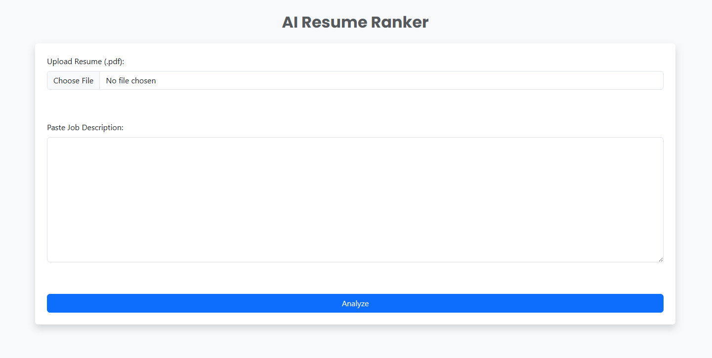
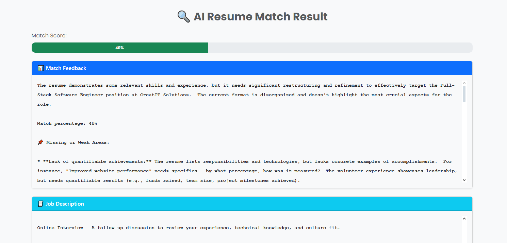

# AI Resume Analyzer 🔍🤖

This is an AI-powered resume analyzer web app built with Flask and Google's Gemini AI. Users can upload their resumes and paste job descriptions. The AI will analyze how well the resume matches the job and give feedback, a match score, and suggestions for improvement.

## 🚀 Features

- Upload a PDF resume
- Paste a job description
- Get:
  - ✅ Match score (progress bar)
  - 📌 Gemini AI feedback
  - ❗ Missing or weak skills
  - 📈 Suggestions for improvement
- Beautiful Bootstrap-based UI
- Responsive and user-friendly design

## 🛠 Tech Stack

- Python (Flask)
- HTML + Bootstrap 5
- Google Gemini API
- PDFPlumber (PDF parsing)

## 📸 Screenshots

> _Tip: Add screenshots here or paste images in your GitHub README directly!_




## 🔧 Setup Instructions

1. **Clone the repository**:

```bash
git clone https://github.com/yourusername/ai-resume-analyzer.git
cd ai-resume-analyzer
```
2. **Create virtual environment (optional but recommended):**
```bash
python -m venv venv
source venv/bin/activate  # On Windows: venv\Scripts\activate
```
3. **Install dependencies:**
```bash
pip install -r requirements.txt
```
4. **Add .env file with your Gemini API key:**
```bash
GEMINI_API_KEY=your_api_key_here
```
5. **Run the app:**
```bash
python app.py
```

## 📦 Optional Enhancements
* Save user login/dashboard with Flask + SQLite

* Highlight missing skills in red

* Export analysis as PDF

* Add history of past analyses

## 🌍 Live Demo
_Coming soon on_ Render, Railway, or Replit...

## 🪪 License
This project is open-source under the [MIT License](LICENSE).